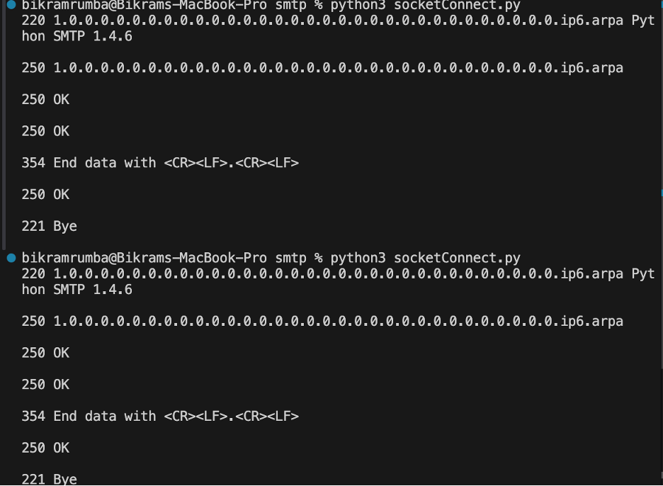
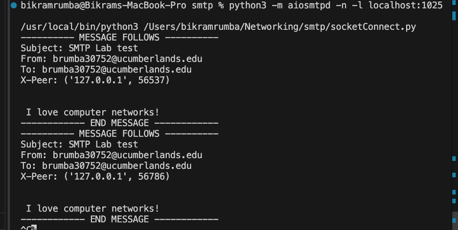

# SMTP Mail Client

A simple Python implementation of an SMTP mail client using raw socket programming.

## Requirements

- Python 3.x
- No external libraries required (uses built-in `socket` module)

## Installation

Clone the repository:
```bash
git clone https://github.com/Rumba19/smtp_protocol
cd smtp_protocol
```

## Configuration

The code is configured to use a **localhost test server** by default.


 **Run with Localhost (Recommended for Testing)** 
 - Start the local SMTP test server in a separate terminal:
  
   ```bash
   python3 -m aiosmtpd -n -l localhost:1025
   ```
- The code is already configured for localhost - no changes needed!
 
## Running the Program
**With Localhost Test Server:**
1. **Terminal 1**- Start the test server:   
    ```bash
    python3 -m aiosmtpd -n -l localhost:1025
    ```

2. **Terminal 2**- Run the client:   
    ```bash
    python3 socketConnect.py     
    ``` 
## Expected Output

```
220 smtp.example.com ESMTP Ready
250 Hello Alice
250 OK
250 OK
354 Start mail input
250 Message accepted
221 Bye
```




## Troubleshooting


**Using Localhost**
- Make sure the test server is running first in a separate terminal
- Both client and server should show communication
 

**Error: "Connection refused"**
- For localhost: Start the test server first
- For real servers: Check network/firewall settings

